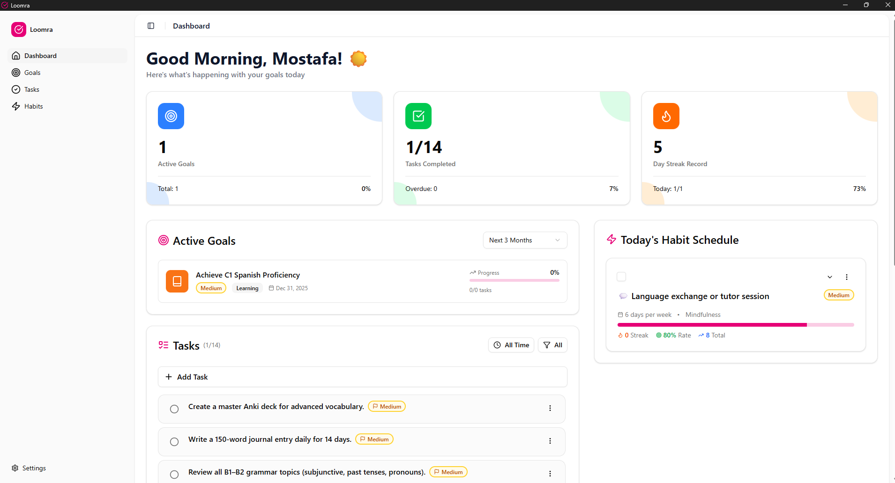

<h1 style="display: flex; align-items: center; gap: 8px;">
  
  Loomra
</h1>

A modern goal tracking and habit building desktop application built with Next.js and Tauri.



## 📋 Table of Contents

- [Getting Started](#-getting-started)
- [Development](#️-development)
- [Building](#️-building)
- [Database](#️-database)
- [Scripts](#-scripts)
- [Contributing](#-contributing)
- [Code of Conduct](#-code-of-conduct)
- [License](#-license)
- [Security](#-security)
- [Contact](#-contact)

## 🚀 Getting Started

### Prerequisites

- Node.js (v20 or higher)
- Rust (latest stable version)
- Windows 10/11
- Platform-specific requirements for Tauri on Windows

### Installation

```bash
# Clone the repository
git clone https://github.com/MostafaWaleed0/loomra.git

# Navigate to project directory
cd loomra

# Install dependencies
npm install
```

## 🛠️ Development

Start the development server:

```bash
npm run tauri:dev
```

This will launch the application in development mode with hot-reload enabled for both the frontend and backend.

## 🏗️ Building

Build the application for Windows:

```bash
npm run tauri:build
```

For debug builds:

```bash
npm run tauri:build:debug
```

The built application will be available in `src-tauri/target/release/` (or `target/debug/` for debug builds).

**Note:** Loomra currently officially supports Windows only. macOS and Linux builds are not tested or supported at this time.

## 🗄️ Database

Loomra uses SQLite for local data storage with the following tables:

- `goals` – User goals and objectives
- `habits` – Habit tracking data
- `habit_completions` – Daily habit completion records
- `tasks` – Task management
- `notification_schedules` – Scheduled habit notifications
- `notification_history` – Sent notification records

All database operations are handled securely via Tauri commands.

## 📝 Scripts

| Command                     | Description                  |
| --------------------------- | ---------------------------- |
| `npm run tauri:dev`         | Start development mode       |
| `npm run tauri:build`       | Build production application |
| `npm run tauri:build:debug` | Build debug version          |
| `npm run build`             | Build Next.js only           |
| `npm run dev`               | Run Next.js dev server       |

## 🤝 Contributing

We welcome contributions from the community! Before contributing, please:

1. Read our [Contributing Guidelines](CONTRIBUTING.md)
2. Review our [Code of Conduct](CODE_OF_CONDUCT.md)
3. Understand the [License](LICENSE) terms

**Quick Contribution Steps:**

1. Fork the repository
2. Create a feature branch (`git checkout -b feature/amazing-feature`)
3. Commit your changes (`git commit -m 'Add amazing feature'`)
4. Push to your branch (`git push origin feature/amazing-feature`)
5. Open a Pull Request

**Note:** By submitting a pull request, you agree to the Contributor License Grant outlined in the [LICENSE](LICENSE) file.

## 📜 Code of Conduct

Please read our [Code of Conduct](CODE_OF_CONDUCT.md) to understand the expectations for all participants in our community.

## 📄 License

This project is licensed under the Loomra Source-Available License. See the [LICENSE](LICENSE) file for details.

**Key Points:**

- ✅ Free for personal, non-commercial use
- ✅ Source code available for educational purposes
- ❌ No commercial use without permission
- ❌ Cannot be used in other projects or competing products

For commercial licensing inquiries, please contact mw.dev500@gmail.com

## 🔒 Security

### Reporting Security Vulnerabilities

If you discover a security vulnerability, please report it responsibly:

**Email:** mw.dev500@gmail.com

**Please include:**

- Description of the vulnerability
- Steps to reproduce
- Potential impact
- Suggested fix (if any)

**Do NOT:**

- Open a public issue for security vulnerabilities
- Disclose the vulnerability publicly before it's been addressed

We take security seriously and will respond to legitimate reports as quickly as possible.

### Security Best Practices

Loomra implements several security measures:

- All database operations are handled through secure Tauri commands
- No direct access to system resources from the frontend
- Local-only data storage (no cloud sync)

## 📞 Contact

**Maintainer:** Mostafa Waleed

- GitHub: [@MostafaWaleed0](https://github.com/MostafaWaleed0)
- Email: mw.dev500@gmail.com

---

**Made with ❤️ by Mostafa Waleed**
